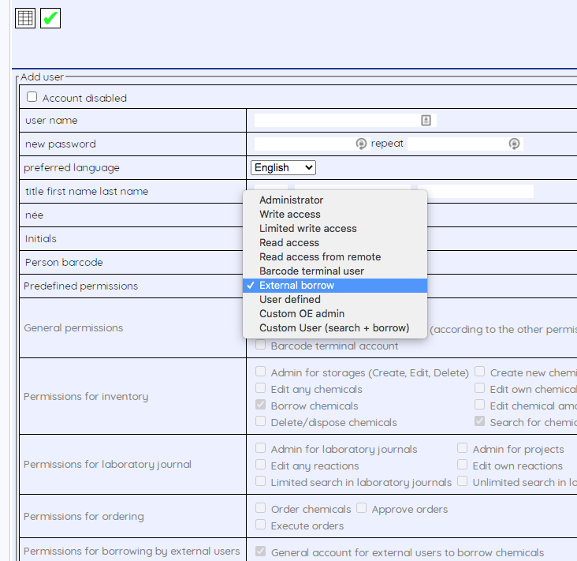
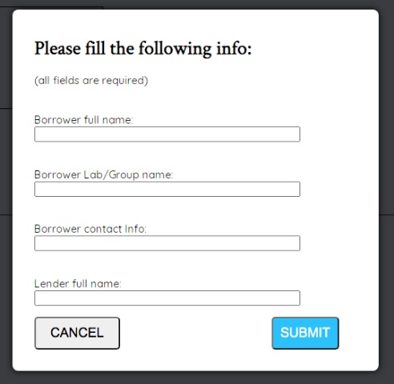

### TO DO:
- Add global_settings for root user to turn on location sharing (show locations for users of other databases)
- create sublocation and include barcode

### 2020-09-26

- Add: option for **borrowing of chemicals by users from outside of the group (guests)**
  - **Details**: The idea is each group should have one ‘user’ account designated for external users (users from outside of the group, guests). When someone outside of the group comes and borrows a chemical containers, this account barcode should be scanned and following by the container barcode. This specific account (made by turning on a specific permission setting `External borrow` in `Predefined permission`) is set so that during checking out of a chemical container by this account, a pop up window would open and ask for the specific info (borrower’s name, group, contact info, and the group member assisting during checkout). This info is then saved into the history entry of that exact checkout event.
  - **To use this function**:
    1. Create a new user, some thing like ‘guests_<database_name>’ for example.
    2. While creating this user, choose the following ‘External borrow’ in the ‘Predefined permissions’
       
    3. Use this new account in the OE barcode terminal. During checkout, a popup window like this should open to ask for more info:
       

### 2020-09-24

- Add: Select2 javascript library to give users a customizable select box with support for searching, filtering
  

### 2020-09-10

- Change: allow username to be up to 32 character

### 2020-08-18

- Add yyyy-mm-dd date format for import chemicals from Excel file
- Change to import function to take user input name as the default name of the new molecule (if the molecule does not yet exist)

### 2020-08-03

- Merge with Felix v2020-07-27. Noticeable changes include:
  - 2020-07-27:
    - date format localized, depending on language of user
    - added missing suppliers, Sigma and Oakwood fixed
    - minor fixes
  - 2020-07-13:
    - added the option to import experiments from https://sciflection.com. Read more about [Sciflection](docs/sciflection_short_v.1.pdf)
    - and to upload lab notebook entries including spectra - much better than just supporting info
    - optional: [installation script](INSTALL/install_open_enventory.sh), which will download and install the latest version on Ubuntu 20.04 LTS (and possibly other Linux distributions) from https://sciformation-demo.eu
    - minor fixes

### 2020-06-19

- Add ability to sort by 'order_date' in 'chemical_storage' table

### 2020-06-06

- Add ChemDraw JS into drawing tools for both Inventory and ELN. To use it:
  - You need to obtain the ChemDrawJS license from [ChemDraw support](https://informatics.perkinelmer.com/Support/Contact). You should be able to obtain Chemdraw JS license if your department/institution has site license for ChemOffice Professional, according to [this](https://www.perkinelmer.com/lab-solutions/resources/docs/PRI_Whats-New_ChemDraw_ChemOffice-19.pdf).
  - After you obtain the ChemDraw JS license file, rename it to "ChemDraw-JS-License.xml" if neccessary and put that file into [`chemdraw` folder](./chemdraw)
  - Turning on ChemDraw as your drawing tools by going into `Settings > Personal settings > Molecule editing` (for your own preference) or `Settings > Global settings > Molecule editing` (for your whole database setting) and change `Structure drawing program` and `Structure drawing program for reactions`.

### 2020-05-17

- Add function to extract currency when it is in front of the amount
- Merge with Felix Rudolphi Official Release of OE-2020-05-03
- Fix TCI scraping due to its new website
- Fix: buttons size in Lab Notebook side
- Fix: Ketcher window size in Inventory and ELN sides
- Fix: bug preventing showing of "Print DYMO label" button (Reported by Gaël De Leener, PhD, Université libre de Bruxelles, Belgium. Thanks, Gaël!)
- Fix "Reset" button in rxnSearch in ELN
- Fix wrong Tooltip for some "Reset" buttons
- Fix some English translation
- Fix PHP7 Warning: count()
- The following features are from Felix Rudolphi:
  - Fix: Ketcher 1.0 bug
  - Add: ChemDoodleWeb drawing 9.1.0 for both Inventory and ELN
  - Add: Ketcher 2.0 beta for both Inventory and ELN

### 2020-04-24

- Fix: typo cause PHP Warning "Illegal String offset"
- Fix: error in "Import and Edit" chemical containers where it rejects containers without CAS and name even if barcode existed.

### 2020-03-12

- Fix for search by container barcode for customized barcode starts with '2'. Why: some users has reported in the case of customized chemical barcodes, for example '10001' or '11345' or '22069', when searching using barcodes, all of those starts with '1' works fine but those starts with '2' don't return the correct result. This is because the automatically generated barcode by OE starts with '2' and in the code, all search query for barcode starts with '2' will be modified. This commit fixes this issue.
- Add "**Import and Edit**" and "Import Only" options in the **Settings** menu for admin roles.
  - "**Import and Edit**" option is similar to previous version of **Import** in which it allows admin users to import: **chemical containers** ("packages"), **storages** list, **user** list, and **supplier offers**. For **chemical containers** ("packages"), this function will check if the database has the chemicals based on **provided barcode**. If the barcode is not found, it will add new container. If the barcode is found, it will change the provided info for that container.
  - "**Import Only**": only allow importing of **chemical containers** **AND** it will **NOT** check for existing container.
  - Right now, this function will only turned on for MIT and Baylor University.
  - To add your own institution, you need:
    1. Creating `lib_customization.your-school-name.php` with *your-school-name* is short or abbreviation of your school name. Use `lib_customization.mit.php` for an example
    2. Add the following line inside `lib_customization.your-school-name.php` after `$default_g_settings["order_system"]="fundp";`:

        ```php
        /* Khoi: add customization identifier so that codes specific for your-school-name will be execute. Only change if you know what you are doing */
        $default_g_settings["customization"]="your-school-name";
        ```
    3. Modify `lib_global_settings.php` by:
       - Change this:
       ```php
       define("customization",""); // Customization to use: f.e.: ".sample" for use of "lib_customization.sample.php", and "" for "lib_customization.php"
       ```

       - To:
       ```php
       define("customization",".your-school-name"); // Customization to use: f.e.: ".sample" for use of "lib_customization.sample.php", and "" for "lib_customization.php"
       ```

       Notice there is a **period** (**.**) in front of "your-school-name".

    4. Modify `sidenav.php` by:
       - Right before this line:
       ```php
       showSideLink(array("url" => "import_edit.php","text" => s("import_edit_tab_sep"), "target" => "mainpage", ));
       ```

       On this line:
       ```php
       if (in_array($g_settings["customization"], array("baylor", "mit"), true)) {
       ```
       add `"your-school-name"` (the same as "your-school-name" set in `lib_customization.your-school-name.php`) right at the end of the array list of institutions. For example:
            ```php
            if (in_array($g_settings["customization"], array("baylor", "mit", "your-school-name", ), true)) {
            ```
<br/>


### 2020-02-01:

- Add support for importing/deleting from Excel files (both .xlsx and xls).
- Add support for importing/deleting from csv (comma-separated text) files. Previously, only tab-separated text files are supported

### 2019-11-22:

- Changed default criterion to "contains" instead of "is similar to" in
  Structure search
- Made sidenav width resizeable for user that use Bootstrap4
- Made sidenav width automatically expand in Structure search
- Change format message in Terminal Mode to be more visible
- Change 'User Guides' to direct to gitbook (https://open-enventory.gitbook.io/)


### 2019-09-30:
- Added storage barcode and person barcode columns in their respective setting pages
- Added option to shorten the criteria list in Simple search in Inventory
    (developed for Baylor University)
- Fixed bug where date are deleted in edit mode
- Added placeholder for input type date in edit mode with yyyy-mm-dd
- Added function to delete multiple containers via import text
- Updated ChemDoodle to ChemDoodleWeb Component v8.0.0
- Upgraded Ketcher to v1.1-beta
- Added 'liters' and 'liter' to the list of recognizing units when importing text file
- Let the cursor default to be in 'Database' input field on login page,
    fix for Firefox
- Added User guides section


### 2019-07-29:
- Fixed Sigma-Aldrich cannot be accessed from A2 Hosting
- Fixed changed location inside normal OE window does not record in History text
- Added storage barcode for export functions
- Added user barcode for export functions
- Added show column for storage
- Added show column for user
- Fixed minor issue with "Disposed chemicals" list does not show correct view
- Applied changes from official OE version 2019-07-24

### 2019-07-17:
- Added date style to yyyy-mm-dd hh:mm:ss when display in OE so there is no confusion in date style
- Added a new login page with mobile responsive
- Modified sidenav, topnav to use Bootstrap4
- Added option for admin user to turn Bootstrap 4 option on/off in global_settings

### 2019-07-03:
- fixed bug in Terminal mode: barcodeTerminalAsync.php and lib_language_en.php
        while doing inventory for a container (inventory mode or "Set storage
        for all following containers"), if you scan a non-existing barcode,
        the location will be removed. When a non-existent barcode is scanned,
        an error pop-up window appears.
- modified History log text to add storage_name; also added History log text
        when changing storage in edit mode (lib_db_manip.php, lib_db_manip_edit.php)

### 2019-06-11:
- import.php, lib_import.php: added importing function for locations and
        users using tab-separated text file
- lib_import.php: fix for importing chemical_storage_barcode bug.
        When import tab-dilimited text file of chemical containers, if the
        barcode column is the last column, it will add white space or \n
        character, making the barcodes inaccurate. The fix will trim all the
        white space (\t\n) on the right side of the input column
- topnav.php, style.css.php, lib_global_funcs.php, lib_sidenav_funcs.php
        sidenav.php: edited some fonts, styles

### 2019-06-04:
- lib_language_en.php, sidenav.php, barcode_autogeneration.php:
        Creating option for admin user to auto generate all location and
        user barcodes while using "Existing barcodes" functions

### 2019-05-25:
- lib_db_manip.php: edit logging text to reflect chemical containers when
    being moved from one location to another

### 2019-05-23:
- multiple files: Fixed functions for php7 warning
- Fixed "Set storage for all following containers" in Terminal
- Added barcode Type 128 generation for user using existing barcode
- import.php, lib_import.php: Fixed added order_date and open_date in
        Import tab-separated text file function
